# Kubernetes — Complete Revision Notes

---

## Table of Contents

| # | Section | What you'll revise |
|---|---------|--------------------|
| 1 | [Why Kubernetes Exists](#1-why-kubernetes-exists) | The problem K8s solves |
| 2 | [Core Architecture](#2-core-architecture) | Cluster, Nodes, Pods, Control Plane |
| 3 | [Components Deep Dive](#3-components-deep-dive) | API Server, etcd, Scheduler, Kubelet… |
| 4 | [Installation & Setup](#4-installation--setup) | kubectl + Minikube on Win/Mac/Linux |
| 5 | [First Deployment (Imperative)](#5-first-deployment-imperative) | `create deployment`, `expose` |
| 6 | [Services & Port Exposure](#6-services--port-exposure) | Why localhost:80 fails |
| 7 | [Deploying Your Own App](#7-deploying-your-own-app) | Docker build → push → deploy |
| 8 | [Updates, Rollout & Rollback](#8-updates-rollout--rollback) | Zero-downtime deploys |
| 9 | [Self-Healing](#9-self-healing) | Auto-restart on crash |
| 10 | [Scaling](#10-scaling) | Replicas & load distribution |
| 11 | [YAML Configuration Files](#11-yaml-configuration-files-declarative) | Declarative K8s |
| 12 | [Multi-Container Apps](#12-multi-container-applications) | Node + MongoDB |
| 13 | [ConfigMaps & Env Variables](#13-configmaps--environment-variables) | Dynamic config |
| 14 | [Volumes & Persistent Storage](#14-volumes--data-management) | PV, PVC, hostPath |
| 15 | [Command Cheat Sheet](#15-command-cheat-sheet) | Everything in one table |
| 16 | [Troubleshooting Playbook](#16-troubleshooting-playbook) | Common errors & fixes |
| 17 | [Exam / Interview Quick-Fire](#17-exam--interview-quick-fire) | Rapid recall |

---

## 1. Why Kubernetes Exists

### The Orchestra Analogy

The tutorial opens with a memorable analogy that's worth keeping:

An **orchestra** has many musicians playing different instruments. Without a conductor, it's noise. The conductor reads from a **score** (sheet music) and coordinates everyone into harmony.

| Orchestra | Kubernetes |
|-----------|------------|
| Conductor / Maestro | **Kubernetes Control Plane (Master)** |
| Musicians & instruments | **Containers running your apps** |
| The written score / sheet music | **Your YAML configuration files** |
| A beautiful performance | **A healthy, running system** |

Kubernetes = a **container orchestrator**. It reads your desired state (the score) and makes reality match it.

### The Real-World Problem

Picture a developer who builds a web app, containerises it with Docker, and deploys it to **one server**:

```
Developer → Docker image → 1 Server → Users 
```

Everything works… until it doesn't:

| Problem | Consequence |
|---------|-------------|
| 🔥 **Traffic spike** — app goes viral | Server can't handle load → slow → crash |
| 💀 **Server fails** | 100% downtime, app completely dead |
| 🐌 **Manual recovery** | Hours to diagnose and fix |

**Naive fix:** Deploy to multiple servers manually.
- ✅ Removes single point of failure
- ✅ Enables load balancing
- ❌ **But** — who manages 3, 30, or 300 servers with hundreds of containers? Who restarts crashed apps at 3 AM? Who rolls out a new version without downtime?

**Manual management does not scale.** That's the gap Kubernetes fills.

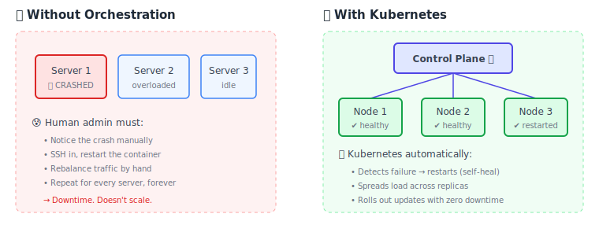

### What Kubernetes Gives You

| Capability | Meaning |
|------------|---------|
| **Container Orchestration** | Manage containers across many machines from one place |
| **High Availability** | Zero downtime — if one instance dies, another serves traffic |
| **Scalability** | Grow from 1 → N instances as user base grows |
| **Load Balancing** | Distribute incoming traffic; minimise latency |
| **Self-Healing** | Crashed containers are restarted automatically |
| **Rollout & Rollback** | Ship new versions safely; revert instantly if broken |

> 💡 **Revision hook:** Kubernetes supports *any* infrastructure — bare metal, VMs, or cloud.

---

## 2. Core Architecture

### The Vocabulary (learn these four words first)

| Term | Definition | Mental Model |
|------|------------|--------------|
| **Node** | A single server (physical, virtual, or cloud) that runs your workloads. Historically called a *"minion"*. | One machine |
| **Cluster** | A **group of nodes** working together. | The whole fleet |
| **Pod** | The **smallest deployable unit** in K8s. An isolated environment with its own resources that runs **one or more containers**. | A "wrapper" around containers |
| **Control Plane (Master)** | The brain that manages all worker nodes. | The conductor |

### The Nesting Hierarchy — Critical for Understanding Networking

This is the single most important diagram in the whole course. **Almost every beginner bug traces back to forgetting these layers.**

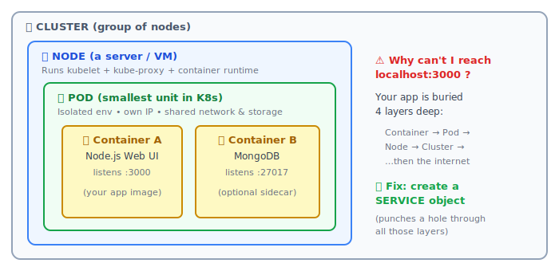

### Master vs Worker Nodes

When you install Kubernetes, you get a cluster split into two roles:

```
┌──────────────────────────────────┐
│    MASTER NODE / CONTROL PLANE   │  ← manages everything
│  ┌────────────────────────────┐  │
│  │ API Server • Scheduler     │  │
│  │ etcd • Controller Manager  │  │
│  └────────────────────────────┘  │
└──────────────┬───────────────────┘
               │ (talks via API Server)
    ┌──────────┼──────────┐
    ▼          ▼          ▼
┌────────┐ ┌────────┐ ┌────────┐
│WORKER 1│ │WORKER 2│ │WORKER 3│   ← run the actual apps
│ kubelet│ │ kubelet│ │ kubelet│
│ k-proxy│ │ k-proxy│ │ k-proxy│
│  Pods  │ │  Pods  │ │  Pods  │
└────────┘ └────────┘ └────────┘
```

> 📝 **Note from the tutorial:** The master *can* technically run on a worker node, **but ideally keep it separate.** With Minikube (local learning), master + worker live on the **same single node** — that's fine for testing.

---

## 3. Components Deep Dive

### Master / Control Plane Components

| Component | Job | Analogy |
|-----------|-----|---------|
| **API Server** | The **entry point / interface** to the cluster. Everything (including `kubectl`) talks to K8s *through* it. | The receptionist |
| **Scheduler** | Assigns a **node** to each newly created Pod. Decides *"which server should run this?"* | The seating planner |
| **etcd** | A **key-value store** holding **all cluster data** — nodes, pods, configs, state. | The cluster's memory / logbook |
| **Controller Manager** | Watches and **maintains the desired state**. Notices a broken instrument → replaces it. | The quality inspector |

### Worker Node Components

| Component | Job |
|-----------|-----|
| **Kubelet** | The **agent** on every worker node. Ensures containers are **running healthily inside Pods**. Because containers run *inside a Pod*, the kubelet has control over them. |
| **Kube-proxy** | Maintains **network rules** for communication with Pods — inside the cluster and from the outside world. |
| **Container Runtime** | The tool that actually **runs containers** (e.g., **Docker**, containerd). |

### How a Pod Actually Gets Created — Follow the Flow

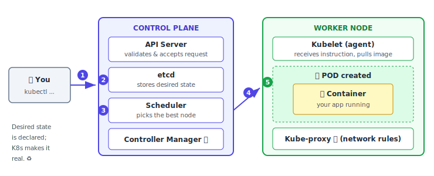

**In words:**
1. You run `kubectl create deployment ...`
2. The **API Server** accepts it → **etcd** records the desired state
3. The **Scheduler** assigns the Pod to a suitable worker node
4. That node's **Kubelet** is told to act
5. Kubelet pulls the image (from Docker Hub / registry) and starts the **container inside a Pod**
6. **Controller Manager** keeps watching forever — if reality drifts from the desired state, it corrects it

---

## 4. Installation & Setup

You need **two tools**:

| Tool | Purpose |
|------|---------|
| **kubectl** (`kube control`) | The **CLI** used to send instructions to the cluster (talks to the API Server) |
| **Minikube** | A **local, single-node Kubernetes cluster** — purpose-built for learning & development |

> **Minikube prerequisites:** Docker **or** a VM environment, 2 CPUs, 2 GB free RAM, 20 GB free disk, internet connection.

### 🪟 Windows (via Chocolatey)

```powershell
# 1. Install Chocolatey first (run PowerShell as Administrator)
#    → copy the install command from chocolatey.org

# 2. Install kubectl (run CMD as Administrator)
choco install kubernetes-cli

# 3. Verify
kubectl version --client

# 4. Create the kube config directory
cd %USERPROFILE%
mkdir .kube
#    → then manually create an empty file named "config" inside .kube

# 5. Install Minikube
choco install minikube
```

### 🍎 macOS (via Homebrew)

```bash
# 1. Install Homebrew (if you don't have it) — see brew.sh

# 2. Install kubectl
brew install kubectl
kubectl version --client

# 3. Install Minikube
brew install minikube
```

> On Apple Silicon (M1/M2), some virtualisation tools are fiddly. **Simplest path: just use Docker** as the driver.

### 🐧 Linux (RPM-based example)

```bash
# 1. Add the Kubernetes repo, then:
yum install -y kubectl
kubectl version --client

# 2. Install Minikube (RPM method), then verify
minikube status
```

### Starting Your Cluster

```bash
minikube start                      # auto-selects a driver (usually Docker)
minikube status                     # host / kubelet / apiserver state
minikube dashboard                  # opens a web UI on localhost
minikube stop                       # stop the cluster (data survives)
minikube delete                     # completely remove the cluster
```

**Specifying a driver explicitly:**

```bash
minikube start --driver=docker
minikube start --driver=virtualbox
minikube start --driver=hyperv
```

**Verify the control plane is alive:**

```bash
kubectl cluster-info
# → "Kubernetes control plane is running at https://..."
```

### 🚨 Common Install Errors (from the tutorial's live debugging)

| Error | Cause | Fix |
|-------|-------|-----|
| Permission errors on Windows | CMD/PowerShell not elevated | **Run as Administrator** |
| `The docker driver should not be used with root privileges` | You're logged in as `root` | Switch to a normal user: `su - <user>` |
| Docker permission denied as normal user | User not in the `docker` group | `sudo usermod -aG docker $USER && newgrp docker` — verify with `id` |
| `Insufficient container memory` | Not enough RAM allocated | Free memory / increase VM memory (`free -h` to check) |
| VirtualBox driver fails | VT-x / AMD-V disabled | Enable virtualisation in BIOS, or just use `--driver=docker` |

> ✅ **Sanity check after install:** `minikube status` should show `host: Running`, `kubelet: Running`, `apiserver: Running`, and `type: Control Plane`.
>
> Notice: **the same single node acts as both control plane and worker** in Minikube. This is *expected* for local dev.

---

## 5. First Deployment (Imperative)

Let's deploy **nginx** (a ready-made image from Docker Hub) to prove the cluster works.

### Step 1 — Create a Deployment

```bash
kubectl create deployment my-nginx --image=nginx
```

You can pin a version with a tag; without one, `:latest` is assumed:

```bash
kubectl create deployment my-nginx --image=nginx:latest
```

> 📌 **Key point:** A bare image name (e.g. `nginx`) is pulled from **Docker Hub by default**. To use another registry, supply the **full path**.

### Step 2 — Inspect What Happened

```bash
kubectl get deployments     # READY 1/1, UP-TO-DATE 1, AVAILABLE 1
kubectl get pods            # my-nginx-7c8b9d5f4-x2k9p   1/1   Running
```

**Notice the Pod name:** `my-nginx` + a **unique hash suffix**. You never created the Pod directly — **the Deployment created it for you**.

### The Object Hierarchy (memorise this!)

```
   DEPLOYMENT  (you create this)
        │  manages
        ▼
   REPLICASET  (auto-created)
        │  manages
        ▼
      POD(s)   (auto-created)
        │  contains
        ▼
   CONTAINER(s)  (your app)
```

### Step 3 — Debugging & Observability

```bash
kubectl logs <pod-name>            # container's stdout/stderr
kubectl describe pods              # events, IP, image, restart history
kubectl delete deployment <name>   # removes deployment + its Pods
minikube dashboard                 # visual view of everything
```

`kubectl describe pods` shows an **Events** timeline — the exact story of the Pod:
`Scheduled` → `Pulling image` → `Pulled` → `Created container` → `Started container`

> 💡 Each Pod also gets its **own IP address** — visible in `describe`.

---

## 6. Services & Port Exposure

### The Problem: Why `localhost:80` Returns Nothing

nginx is running and listening on port **80**. So you open `http://localhost:80`… and **nothing happens.**

**Why?** Recall the nesting diagram. Your app sits *inside a container*, *inside a Pod*, *inside a Node*, *inside a Cluster*. The outside world can't reach through all those layers.

```
🌍 Internet  ✗──✗──✗──✗──▶  [Cluster [ Node [ Pod [ 🐳 nginx:80 ]]]]
                                        ⛔ BLOCKED
```

### The Solution: A Service Object

Just like Docker needs **port binding** (`-p 8080:80`), Kubernetes needs a **Service** — but the mechanism is different.

```bash
kubectl expose deployment my-nginx --port=80 --type=LoadBalancer
```

| Flag | Meaning |
|------|---------|
| `--port=80` | The port the app **listens on inside the container** |
| `--type=LoadBalancer` | The service type — most common/useful for external access |

```bash
kubectl get services       # confirm the service exists
```

### Step 3 — Minikube-Specific: Get the URL

Creating the Service **still isn't enough on Minikube** (it runs inside Docker). You must ask Minikube to surface it:

```bash
minikube service my-nginx
```

This prints a **URL/IP** and opens the browser → **"Welcome to nginx!"** 🎉

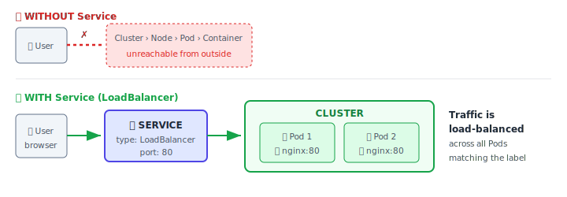

### ⚠️ Two-Command Rule on Minikube

```bash
kubectl expose deployment my-app --type=LoadBalancer --port=3000   # 1️⃣ create Service
minikube service my-app                                            # 2️⃣ get accessible URL
```

Forgetting step 2 is one of the most common beginner frustrations.

---

## 7. Deploying Your Own App

Now the real workflow — deploying **an app you built yourself**.

### Step 1 — Build a Sample React App

```bash
node -v                        # verify Node.js is installed
npx create-react-app test-app  # ⚠️ project name MUST be lowercase
cd test-app
npm start                      # runs on http://localhost:3000
```

Edit `src/App.js` → change some text → save → restart. Confirm the change appears.

### Step 2 — Write a Dockerfile

```dockerfile
FROM node:20
WORKDIR /my-app
COPY . .
RUN npm install
CMD ["npm", "start"]
```

> Remove `node_modules` before building — `npm install` regenerates it inside the image.

### Step 3 — Build & Push to a Registry

**🔑 The critical rule:** *Kubernetes cannot use a local image.* You **must push it to a registry** so K8s can pull it.

```bash
# Tag using your registry naming convention: <username>/<repo>:<version>
docker build -t <your-dockerhub-user>/web-app-demo:02 .
docker images                                       # verify it's built locally

docker login
docker push <your-dockerhub-user>/web-app-demo:02   # now visible in Docker Hub
```

### Step 4 — Deploy to Kubernetes

```bash
minikube status                        # cluster up?
minikube start                         # if stopped

kubectl create deployment my-web-app --image=<your-user>/web-app-demo:02
kubectl get deployments
kubectl get pods

kubectl expose deployment my-web-app --type=LoadBalancer --port=3000
kubectl get services
minikube service my-web-app            # → opens your app 🎉
```

### The Complete Loop

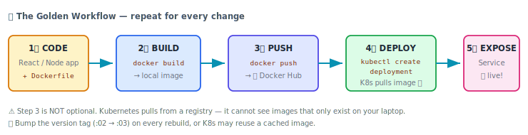

---

## 8. Updates, Rollout & Rollback

### The Requirement: Zero Downtime

Your site is **live in production**. You need to ship a new version — with **zero downtime, not even one second.**

### Step 1 — Change Code → Build → Push New Version

```bash
# edit src/App.js, then:
docker build -t <user>/web-app-demo:05 .
docker push <user>/web-app-demo:05
```

### Step 2 — Point the Deployment at the New Image

```bash
kubectl set image deployment/my-web-app web-app-demo=<user>/web-app-demo:05
#                  ^deployment name      ^container name  ^new image:tag
```

> 🔍 **Where do I find the container name?** In the Dashboard → Pods → scroll to **Containers**. Or use `kubectl describe pods`.

### Step 3 — Watch the Magic

```bash
kubectl get pods
```

You'll observe:

```
NAME                          READY   STATUS              AGE
my-web-app-abc-OLD            1/1     Running             10m   ← still serving traffic!
my-web-app-xyz-NEW            0/1     ContainerCreating   3s    ← booting up
```

Then, moments later:

```
my-web-app-abc-OLD            1/1     Terminating         10m   ← now safely retired
my-web-app-xyz-NEW            1/1     Running             15s   ← live
```

**This is a rolling update.** K8s keeps the **old Pod alive until the new one is fully up and running.** Your live environment is **never impacted**. ✨

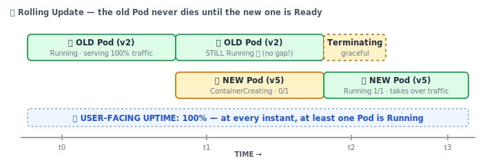

### Switching to Any Version (including going backwards)

```bash
kubectl set image deployment/my-web-app web-app-demo=<user>/web-app-demo:01
```

Same rolling process. Refresh the browser → you're back on v1.

### 🧪 Negative Test: What if the Image Doesn't Exist?

Deliberately set a version that **isn't in the registry** (e.g. `:06`):

```bash
kubectl set image deployment/my-web-app web-app-demo=<user>/web-app-demo:06
kubectl get pods
```

```
NAME                      READY   STATUS             RESTARTS
my-web-app-old            1/1     Running            0          ← ✅ site STILL WORKS
my-web-app-new            0/1     ImagePullBackOff   0          ← ❌ stuck forever
```

**`ImagePullBackOff`** = the image can't be pulled (wrong path / wrong tag / registry unreachable).

**Beautiful behaviour:** the rollout gets **stuck**, but **your live website keeps running on the old Pod.** Kubernetes refuses to kill a healthy Pod for a broken one. 🛡️

### Check Rollout Status

```bash
kubectl rollout status deployment/my-web-app
# → "Waiting for deployment 'my-web-app' rollout to finish: 1 old replicas are pending termination..."
```

It will **wait forever**, because the new Pod will never become ready.

### Rollback (Undo)

```bash
kubectl rollout undo deployment/my-web-app
kubectl get pods    # → back to a single healthy Pod on the correct version ✅
```

| Command | Purpose |
|---------|---------|
| `kubectl set image deployment/<d> <container>=<image>:<tag>` | Roll **out** a new version |
| `kubectl rollout status deployment/<d>` | Is the rollout progressing or stuck? |
| `kubectl rollout undo deployment/<d>` | Roll **back** to the previous version |

---

## 9. Self-Healing

### The Scenario

Your website is live in production. Because of a **glitch or a code crash**, the app **shuts down**. What does Kubernetes do?

The tutorial uses a small **Express demo app** with a deliberate kill-switch route (`/exit`) that force-stops the server — a way to simulate a crash on demand.

### The Experiment

```bash
kubectl create deployment node-app --image=<user>/node-demo-app:01
kubectl expose deployment node-app --type=LoadBalancer --port=3000
minikube service node-app
```

Now visit `<url>/exit` → **the server stops.**

**Watch the Dashboard:**

```
1. 🔴 Everything turns RED  →  Pod has an issue, app is down
2. ⏳ (a few seconds pass)
3. 🟢 Everything turns GREEN →  Kubernetes AUTOMATICALLY restarted it
```

Refresh the browser → **your app is running again.** You did nothing.

### The Evidence: RESTARTS Column

```bash
kubectl get pods
```

```
NAME                        READY   STATUS    RESTARTS   AGE
node-app-6d4cf56db6-vk8lp   1/1     Running   3          12m
                                              ^^^^^^^^
                                    ← it crashed & was revived 3 times
```

> 💡 **This is the Controller Manager doing its job** — continuously comparing *desired state* (1 running Pod) with *actual state* and correcting any drift.

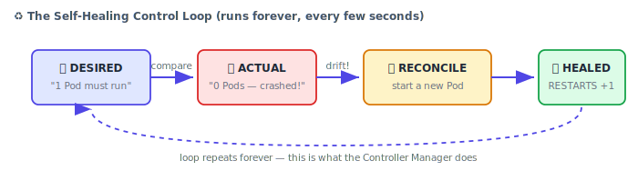

### ⚠️ The Remaining Gap

Self-healing is great, **but** you probably noticed: **the site was down for a few seconds** during the restart.

For a real production system, **even a few seconds is unacceptable.** How do we get to *truly* zero downtime?

👉 **Answer: run multiple instances.** That's the next section.

---

## 10. Scaling

### Why Scale?

| Benefit | Explanation |
|---------|-------------|
| **No single point of failure** | If Pod 1 dies, Pods 2 & 3 keep serving. The site **never** goes down — not even for a second. |
| **Load balancing** | Heavy traffic is **distributed** across all instances → lower latency |

**"Scaling" simply means:** running **multiple identical instances** of your app **in parallel**.

### Scale Up

```bash
kubectl scale deployment node-app --replicas=4
kubectl get pods
```

```
NAME                        READY   STATUS    RESTARTS
node-app-xxx-a1b2c          1/1     Running   0
node-app-xxx-d3e4f          1/1     Running   0
node-app-xxx-g5h6i          1/1     Running   0
node-app-xxx-j7k8l          1/1     Running   0
```

**One command → four Pods.** Instantly.

### Proving It Works: The Chaos Test

Hit `/exit` repeatedly to kill Pods while refreshing the browser:

```
kubectl get pods
NAME                  READY   STATUS    RESTARTS
node-app-xxx-a1b2c    1/1     Running   3      ← restarted 3×
node-app-xxx-d3e4f    1/1     Running   4      ← restarted 4×
node-app-xxx-g5h6i    0/1     Error     2      ← currently down
node-app-xxx-j7k8l    1/1     Running   2      ← restarted 2×
```

**Two crucial observations:**

1. ✅ **The website never went down.** Even with 1 of 4 Pods failed, the other 3 served traffic. **Zero downtime.**
2. ✅ **The RESTARTS counts differ across Pods** — this *proves* the load balancer is genuinely **distributing requests** to different Pods, not hammering the same one.

### Scale Down

```bash
kubectl scale deployment node-app --replicas=2
kubectl get pods    # → 2 Running, 2 Terminating
```

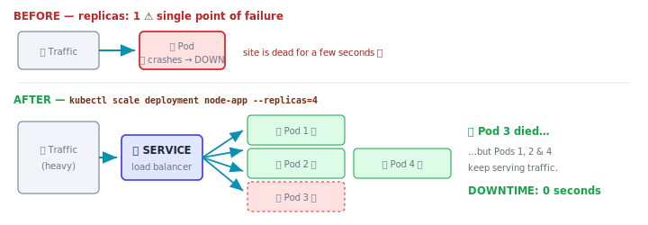

---

## 11. YAML Configuration Files (Declarative)

### Why Move Away from Commands?

Look at everything we've done **imperatively** for just ONE single-container app:

```bash
kubectl create deployment my-app --image=...
kubectl expose deployment my-app --type=LoadBalancer --port=3000
kubectl scale deployment my-app --replicas=4
kubectl set image deployment/my-app container=...
kubectl rollout undo deployment/my-app
```

That's **five separate commands** — and you must remember all of them, in order, forever. It doesn't scale to real systems.

**Solution:** Describe *everything about your app* in a **configuration file** (YAML), exactly like a `docker-compose.yml`. Then apply it with **one command**.

| Imperative (commands) | Declarative (YAML) |
|-----------------------|--------------------|
| "Do this, then this, then this" | "Here is what I want. Make it so." |
| Not repeatable | Version-controlled in Git ✅ |
| Many commands to remember | `kubectl apply -f file.yaml` |
| Hard to review | Reviewable in a pull request |

### 📖 The Documentation Trick (worth its weight in gold)

Don't write YAML from memory. Instead:

1. Go to **kubernetes.io → Documentation → Reference → Kubernetes API**
2. Find the object you want (e.g. **Deployment**)
3. Click **"Show example"**
4. **Copy the official example**, then edit it

> **Why?** ① It's fast. ② It avoids **YAML syntax errors** (indentation is brutal for beginners). ③ It's from the official source, so it's correct.

### Deployment YAML — Explained Line by Line

`deployment-node-app.yaml`

```yaml
apiVersion: apps/v1          # Which API group+version. Deployments live in "apps/v1"
kind: Deployment             # WHAT are we creating? (Deployment / Service / Pod / ConfigMap…)
metadata:
  name: my-node-app          # The deployment's name (this replaces the CLI name argument)
spec:                        # SPECIFICATION of the Deployment itself
  replicas: 2                # 🔥 How many Pod instances? (declares scaling upfront!)
  selector:
    matchLabels:
      app: node-app          # ⚠️ MUST MATCH the pod template's labels below
  template:                  # 👇 Everything below describes the POD the Deployment creates
    metadata:
      labels:
        app: node-app        # ⚠️ MUST MATCH selector.matchLabels above
    spec:                    # SPECIFICATION of the Pod
      containers:            # A list — a Pod can hold MULTIPLE containers
        - name: node-app                              # container name
          image: <user>/node-mongodb:02               # image from your registry
```

### 🚨 The #1 YAML Mistake: Label Mismatch

```yaml
spec:
  selector:
    matchLabels:
      app: node-app     # ← ①
  template:
    metadata:
      labels:
        app: node-app   # ← ② MUST be IDENTICAL to ①
```

If ① ≠ ②, the Deployment can't find its Pods and nothing works. **Always check this first when debugging.**

### Service YAML

`service-node-app.yaml`

```yaml
apiVersion: v1               # Services are in the CORE API → just "v1" (not apps/v1!)
kind: Service
metadata:
  name: service-node-app     # ⭐ This name becomes the DNS hostname inside the cluster
spec:
  ports:
    - name: http
      port: 8080             # port the SERVICE exposes (what clients hit)
      targetPort: 3000       # port the CONTAINER listens on (your app's port)
  selector:
    app: node-app            # ⚠️ Which Pods does this Service route to?
                             #    Any Pod whose label matches. Includes ALL replicas.
  type: LoadBalancer         # external access
```

> 🔑 **How a Service finds its Pods:** purely by **label matching**. It looks at all running Pods and routes to every one whose labels match the `selector` — including every replica.

### Port Mapping Visualised

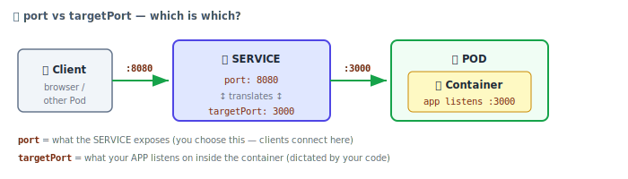

### Applying Config Files

```bash
kubectl apply -f deployment-node-app.yaml    # create OR update
kubectl apply -f service-node-app.yaml

kubectl get deployments
kubectl get pods
kubectl get services

kubectl delete -f deployment-node-app.yaml   # tear down
```

> 📁 **Path note:** The file must be in your current directory, or you must supply the **full path**.
>
> 📛 **Filename:** There is **no standard naming rule** — call it whatever you like, as long as it's `.yaml` / `.yml`.

### ⭐ The Superpower: Change Anything, Re-Apply

Want to scale? **Don't run a scale command.** Just edit the file:

```yaml
spec:
  replicas: 3      # was 2
```

```bash
kubectl apply -f deployment-node-app.yaml
kubectl get pods    # → now 3 Pods 🎉
```

Want to roll out a new version? **Edit the image tag** and re-apply:

```yaml
containers:
  - name: node-app
    image: <user>/node-mongodb:05    # was :02
```

```bash
kubectl apply -f deployment-node-app.yaml    # ← rolling update happens automatically
```

**One command (`kubectl apply -f`) now does everything.** Scale, update, roll back, reconfigure. This is the real power of declarative Kubernetes.

### Combining Multiple Objects in One File

Use `---` (three dashes) to separate documents:

```yaml
apiVersion: apps/v1
kind: Deployment
metadata:
  name: my-node-app
spec:
  # ... deployment spec ...

---                          # 👈 separator between two objects

apiVersion: v1
kind: Service
metadata:
  name: service-node-app
spec:
  # ... service spec ...
```

```bash
kubectl apply -f deployment-node-app.yaml
# → deployment.apps/my-node-app created
# → service/service-node-app created      ← BOTH, in one shot ✅
```

---

## 12. Multi-Container Applications

### The Project

A realistic two-container app:

| Container | Role |
|-----------|------|
| **Node.js Web UI** | A web page where the user submits **emails** |
| **MongoDB** | The **database** storing those emails |

Two architectural options — and the tutorial demonstrates **both**, showing why one is wrong.

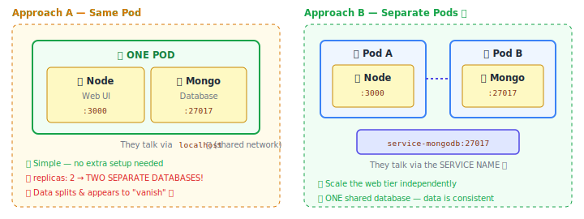

### Approach A — Multiple Containers in the SAME Pod

**Benefit:** containers in one Pod share the **same network and resources**, so communication is trivial — they just use `localhost`.

```javascript
// index.js — Node app connecting to Mongo in the SAME pod
mongoose.connect('mongodb://localhost:27017/mydb')
//                          ^^^^^^^^^ works because they share a network!
```

**YAML — just add a second entry under `containers:`**

```yaml
apiVersion: apps/v1
kind: Deployment
metadata:
  name: my-node-db-app
spec:
  replicas: 2
  selector:
    matchLabels:
      app: node-db-app
  template:
    metadata:
      labels:
        app: node-db-app
    spec:
      containers:
        - name: node-db-app                       # 🐳 Container 1
          image: <user>/node-mongodb:02
        - name: mongodb                           # 🐳 Container 2 — just add to the list!
          image: mongo:latest
```

```bash
kubectl apply -f deployment-node-app.yaml
kubectl get pods    # → 2 Pods, each containing 2 containers
```

### 💀 The Fatal Flaw (a brilliant teaching moment)

Submit an email → refresh → **it disappears** → refresh again → **it comes back!** Data seems to randomly appear and vanish.

**Why?** With `replicas: 2`, you have **2 Pods**, and **each Pod has its own MongoDB container** — so you have **TWO SEPARATE, UNSYNCED DATABASES.**

```
Request 1  →  Service load-balances  →  Pod 1  →  saves email to Mongo #1
Request 2  →  Service load-balances  →  Pod 2  →  reads from Mongo #2 (empty!)
```

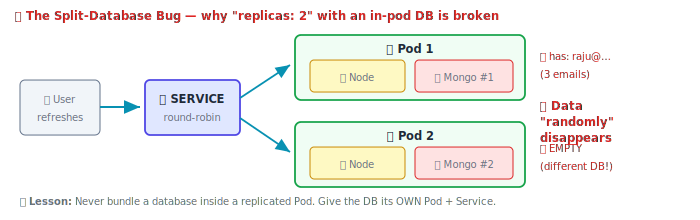

> ⚠️ **Rule to memorise:** **Databases don't belong in a replicated Pod.** Set `replicas: 1`, or better — **move the database to its own Pod.**

### Approach B — Separate Pods (the correct pattern)

Now the interesting question: **if they're in different Pods, how do they communicate?**

**Answer: through the Service name.** 🔑

```
<service-name>:<port>
```

When you create a Service for MongoDB called `service-mongodb`, that name becomes a **DNS hostname** inside the cluster. Any Pod can reach Mongo at `service-mongodb:27017`.

#### Step 1 — Make the App's DB URL Dynamic

Hardcoding `localhost` in the image is inflexible — you can't change it at deploy time. Use **environment variables**:

```javascript
// index.js — BEFORE (static, bad)
mongoose.connect('mongodb://localhost:27017/mydb')

// index.js — AFTER (dynamic, good) ✅
const MONGO_HOST = process.env.MONGO_HOST || 'localhost';
const MONGO_PORT = process.env.MONGO_PORT || '27017';

mongoose.connect(`mongodb://${MONGO_HOST}:${MONGO_PORT}/mydb`);
```

> 🚨 **Live-debugged gotcha from the tutorial:** you **must** use **backticks** (`` ` ``) for template literals — **not single quotes**. With single quotes, `${MONGO_HOST}` is treated as literal text, the connection fails, and the Pod enters **`CrashLoopBackOff`**. This exact bug happened on camera!

Rebuild and push:

```bash
docker build -t <user>/node-mongodb:04 .
docker push <user>/node-mongodb:04
```

#### Step 2 — MongoDB Deployment + Service (`mongo-db.yaml`)

```yaml
apiVersion: apps/v1
kind: Deployment
metadata:
  name: mongo-app
spec:
  replicas: 1                      # ⚠️ Only ONE database instance
  selector:
    matchLabels:
      app: mongo-app
  template:
    metadata:
      labels:
        app: mongo-app
    spec:
      containers:
        - name: mongo-app
          image: mongo:latest

---

apiVersion: v1
kind: Service
metadata:
  name: service-mongodb            # ⭐⭐ THIS NAME IS THE HOSTNAME!
spec:
  ports:
    - name: tcp                    # TCP — it's a database, not HTTP
      port: 27017
      targetPort: 27017
  selector:
    app: mongo-app                 # routes to the mongo Pod
                                   # NOTE: no "type: LoadBalancer" — internal only ✅
```

> 💡 **Why no `LoadBalancer`?** The database should **not** be exposed to the internet. Omitting `type` gives you the default **`ClusterIP`** — reachable only from *inside* the cluster. This is a **security best practice**.

#### Step 3 — Deploy Mongo FIRST

**Order matters.** The Node app needs the Mongo Service name to exist.

```bash
kubectl apply -f mongo-db.yaml
kubectl get deployments
kubectl get services       # → confirm "service-mongodb" exists
```

---

## 13. ConfigMaps & Environment Variables

### The Problem

Our Node app now reads `MONGO_HOST` and `MONGO_PORT` from the environment. **How do we supply those values at deploy time?**

**Answer: a ConfigMap** — a new `kind` whose job is to store configuration as **key–value pairs**, separate from your image.

### Step 1 — Create the ConfigMap (`mongo-config.yaml`)

```yaml
apiVersion: v1
kind: ConfigMap                # 🆕 a new object type
metadata:
  name: mongo-config           # ⭐ we'll reference this name later
data:                          # key–value pairs
  MONGO_HOST: "service-mongodb"   # 👈 the SERVICE NAME from step 2 above!
  MONGO_PORT: "27017"
```

> ⚠️ **Gotcha:** wrap values in **double quotes**. The keys must **exactly match** the env var names your code reads (`process.env.MONGO_HOST`).

```bash
kubectl apply -f mongo-config.yaml    # → configmap/mongo-config created
```

Now Kubernetes **holds those values**, ready to inject.

### Step 2 — Inject Into the Node Deployment (`node-app.yaml`)

```yaml
apiVersion: apps/v1
kind: Deployment
metadata:
  name: node-app
spec:
  replicas: 1
  selector:
    matchLabels:
      app: node-app
  template:
    metadata:
      labels:
        app: node-app
    spec:
      containers:
        - name: node-app
          image: <user>/node-mongodb:04
          env:                                  # 👈 environment variables
            - name: MONGO_HOST                  # env var name (matches your code)
              valueFrom:                        # "where do I get the value?"
                configMapKeyRef:
                  name: mongo-config            # ← the ConfigMap's name
                  key: MONGO_HOST               # ← which key inside it
            - name: MONGO_PORT
              valueFrom:
                configMapKeyRef:
                  name: mongo-config
                  key: MONGO_PORT

---

apiVersion: v1
kind: Service
metadata:
  name: service-node-app
spec:
  ports:
    - name: http
      port: 8080
      targetPort: 3000
  selector:
    app: node-app
  type: LoadBalancer          # ✅ THIS one IS public — it's the web UI
```

### The Full Wiring — How It All Connects

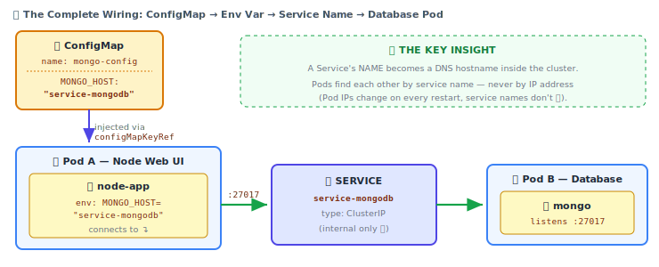

### Step 3 — Deploy in the Right Order

```bash
kubectl apply -f mongo-db.yaml        # 1️⃣ database + its service (creates the hostname)
kubectl apply -f mongo-config.yaml    # 2️⃣ the config map (holds the hostname)
kubectl apply -f node-app.yaml        # 3️⃣ the web app (consumes the config)

minikube service service-node-app     # 🎉 open the app
```

Both Pods now show **Running**, in **different Pods**, successfully **connected**. ✅

### 🩺 Troubleshooting a `CrashLoopBackOff`

The tutorial hits this live. Here's the diagnostic path:

```
Dashboard → Pods → click the RED pod → scroll to EVENTS
```

Events showed: `Scheduled` ✅ → `Pulling image` ✅ → `Successfully pulled` ✅ → **`CrashLoopBackOff`** ❌

**Reading:** the image pulled fine, so it's **not** a registry problem — **the code itself is crashing.** That narrowed it to the single-quote/backtick bug in `index.js`.

| Status | Meaning | Where to look |
|--------|---------|---------------|
| `ImagePullBackOff` | Can't **fetch** the image | Registry path, image tag, credentials |
| `CrashLoopBackOff` | Image pulled, but **app crashes on startup** | Your **code**, env vars, missing deps |

---

## 14. Volumes & Data Management

### The Problem: Your Data Is Doomed

Everything works. Emails are being saved. Then you do something totally routine — **upgrade the MongoDB version**:

```yaml
containers:
  - name: mongo-app
    image: mongo:6      # was mongo:latest
```

```bash
kubectl apply -f mongo-db.yaml
```

Refresh the app… **ALL YOUR DATA IS GONE.** 💀

### Why? Follow the Layers

MongoDB stores its data **inside the container**. But containers are **ephemeral** — by design:

| Event | What happens to container-stored data |
|-------|---------------------------------------|
| Container crashes → K8s self-heals → **new container** | 🔥 **Data lost** |
| Pod is updated/rescheduled → **new Pod** | 🔥 **Data lost** |
| Node restarts | 🔥 **Data lost** |

**Self-healing is a double-edged sword**: K8s happily throws away a broken container and builds a fresh one — and your data goes with it.

### The Evolution of Storage (three levels)

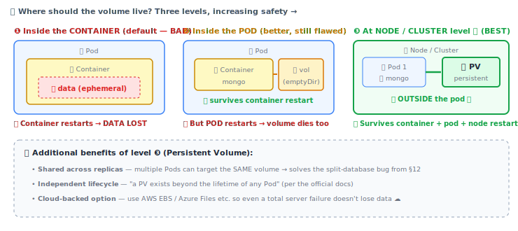

> ⚠️ **Even a node-level volume has a limit:** if the **physical server dies**, the data dies with it. For real production, use a **cloud-based volume** (AWS, Azure, etc.).

### The Two Objects: PV and PVC

Persistent storage in K8s is a **two-step handshake**:

| Object | Role | Analogy |
|--------|------|---------|
| **PersistentVolume (PV)** | **Reserves** a chunk of physical storage in the cluster | Building a warehouse 🏭 |
| **PersistentVolumeClaim (PVC)** | **Requests/claims** storage from that reserved pool | Renting a unit inside it 🔑 |

Your Pod then **mounts the PVC**.

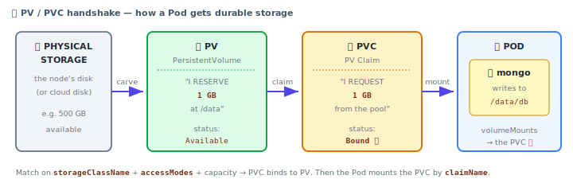

### Step 1 — Create the PersistentVolume (`host-pv.yaml`)

```yaml
apiVersion: v1
kind: PersistentVolume
metadata:
  name: host-pv                  # ⭐ referenced later
spec:
  capacity:
    storage: 1Gi                 # how much space to reserve
  volumeMode: Filesystem         # storing files (vs raw Block)
  storageClassName: standard     # 👈 see note below
  accessModes:
    - ReadWriteOnce              # 👈 see note below
  hostPath:                      # WHERE the storage physically lives
    path: /data                  # path on the host machine
    type: DirectoryOrCreate      # use this dir; create it if missing
```

**`storageClassName: standard` — where does "standard" come from?**

```bash
kubectl get sc          # sc = storage class
# → NAME       PROVISIONER               DEFAULT
#   standard   k8s.io/minikube-hostpath   yes
```

It's the **default storage class** already present in Minikube. It handles storage provisioning dynamically so you don't have to think about it.

**`accessModes` — pick the right one:**

| Mode | Meaning | Use when |
|------|---------|----------|
| `ReadWriteOnce` | Mounted read-write by a **single node** | ✅ Our case — Minikube is a single-node cluster |
| `ReadOnlyMany` | Read-only by **many nodes** | Shared static assets |
| `ReadWriteMany` | Read-write by **many nodes** | Multi-node cluster needing shared writes |

### Step 2 — Create the PersistentVolumeClaim (`host-pvc.yaml`)

```yaml
apiVersion: v1
kind: PersistentVolumeClaim
metadata:
  name: host-pvc                 # ⭐ the Pod will reference THIS name
spec:
  storageClassName: standard     # ⚠️ MUST match the PV's class
  accessModes:
    - ReadWriteOnce              # ⚠️ MUST match the PV's mode
  resources:
    requests:
      storage: 1Gi               # claim the whole 1Gi (you may claim a portion)
```

### Step 3 — Mount It in the MongoDB Deployment

Two additions to `mongo-db.yaml`, both under the Pod's `spec:`

```yaml
    spec:
      containers:
        - name: mongo-app
          image: mongo:latest
          volumeMounts:                    # 👈 ① mount INTO the container
            - mountPath: /data/db          #     the path Mongo writes its data to
              name: mongo-vol              #     ⚠️ must match the volume name below
      volumes:                             # 👈 ② define the volume (container-level indent!)
        - name: mongo-vol                  #     the volume's name
          persistentVolumeClaim:
            claimName: host-pvc            #     ← points at our PVC ✅
```

> 🔍 **How do I know Mongo uses `/data/db`?** It's in the **official MongoDB image documentation on Docker Hub**. Every database image documents its data directory — always check.
>
> 🐛 **Live bug in the tutorial:** `volumeMounts` is a **list** — the entry needs a leading `-` and correct indentation. Getting this wrong throws a validation error on `apply`.

### Step 4 — Apply in Order & Verify

```bash
kubectl apply -f host-pv.yaml
kubectl get pv        # → host-pv   1Gi   RWO   Available

kubectl apply -f host-pvc.yaml
kubectl get pvc       # → host-pvc  Bound  host-pv  1Gi  RWO   ✅ "Bound" = success!

kubectl apply -f mongo-db.yaml    # re-apply so Mongo picks up the volume
```

Both objects are also visible in the **Minikube Dashboard** under *Persistent Volumes* and *Persistent Volume Claims*.

### 🧪 The Proof: Destroy the Database, Keep the Data

**Test 1 — Delete the entire MongoDB Deployment**

```bash
kubectl get deployments
kubectl delete deployment mongo-app
```

Refresh the app → **no emails** (obviously — there's no database to read from!).

```bash
kubectl apply -f mongo-db.yaml      # bring Mongo back
```

Refresh again → **🪄 EVERY SINGLE EMAIL IS BACK.**

The data was never in the container. It was on the **volume, outside the Pod, at cluster level.** The new Mongo Pod mounted the same PVC and found all the old data waiting.

**Test 2 — Nuke the ENTIRE cluster**

```bash
minikube stop         # whole cluster down; site unreachable
minikube status       # → Stopped

minikube start        # bring it all back
minikube dashboard
minikube service service-node-app
```

**All the data survived a full cluster restart.** ✅ *This* is why Persistent Volumes matter.

### Other Volume Types

The docs list many types. Two worth knowing:

#### `emptyDir`

```yaml
volumes:
  - name: cache-vol
    emptyDir: {}
```

- Similar to a plain Docker-managed volume
- Created when a Pod is assigned to a node; **lives and dies with the Pod**
- Docs: *"When a Pod is removed from a node for any reason, the data in the emptyDir is deleted permanently."*
- ✅ Good for: **temporary data, caches, scratch space**
- ❌ Bad for: anything you care about

#### `hostPath` (used directly, without a PV)

```yaml
      volumes:
        - name: my-vol
          hostPath:
            path: /my-data.txt
            type: FileOrCreate      # target a FILE (use DirectoryOrCreate for a folder)
      containers:
        - name: node-file-app
          image: <user>/node-file-demo:01
          volumeMounts:
            - name: my-vol
              mountPath: /app/emails.txt   # path INSIDE the container
```

- Mounts a **file or directory from the host node's filesystem** into the Pod
- Data lives at **node level**, so all Pods on that node can share it
- ⚠️ **Not very secure**; not generally recommended
- ✅ Useful for: internal libraries, temporary file management, single-node testing

> 🎯 **Finding `mountPath`:** it must match where your app actually writes. Check the `WORKDIR` in your Dockerfile! If `WORKDIR /app` and the app writes `emails.txt`, then `mountPath: /app/emails.txt`.

### ⚠️ The `hostPath` Limitation (straight from the docs)

> **"FOR SINGLE NODE TESTING ONLY. WILL NOT WORK IN A MULTI-NODE CLUSTER."**
> *Consider using a `local` volume instead.*

| Environment | Use |
|-------------|-----|
| **Minikube / single-node learning** | `hostPath` ✅ (what we used) |
| **Multi-node cluster** | `local` volume |
| **Production / cloud** | **Cloud volumes** — AWS EBS, Azure File, CSI drivers ⭐ |

> 📌 **Deprecation note:** `awsElasticBlockStore` (the in-tree driver) has been **removed**. The Kubernetes project now recommends the **third-party AWS EBS CSI driver**.

### Volume Decision Tree

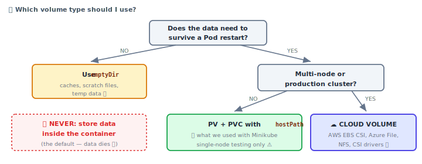

---

## 15. Command Cheat Sheet

### 🚀 Cluster (Minikube)

```bash
minikube start                      # create/start the cluster
minikube start --driver=docker      # specify the driver
minikube status                     # host / kubelet / apiserver status
minikube dashboard                  # web UI
minikube stop                       # stop (data preserved)
minikube delete                     # destroy the cluster
minikube service <service-name>     # ⭐ get the accessible URL for a Service
kubectl cluster-info                # confirm the control plane is running
```

### 📦 Deployments

```bash
kubectl create deployment <name> --image=<image>:<tag>    # imperative create
kubectl get deployments                                   # list
kubectl delete deployment <name>                          # delete (removes its Pods)
kubectl scale deployment <name> --replicas=4              # scale up/down
kubectl set image deployment/<name> <container>=:<tag>   # roll out new version
kubectl rollout status deployment/<name>                  # is the rollout progressing?
kubectl rollout undo deployment/<name>                    # ⏪ roll back
```

### 🔍 Pods & Debugging

```bash
kubectl get pods                    # list Pods (watch STATUS + RESTARTS!)
kubectl logs <pod-name>             # container logs
kubectl describe pods               # ⭐ full details + EVENTS timeline
kubectl describe pod <pod-name>     # for one specific Pod
```

### 🔀 Services

```bash
kubectl expose deployment <name> --type=LoadBalancer --port=<port>
kubectl get services                # list Services
kubectl delete service <name>       # delete a Service
```

### 📄 Declarative (YAML) — the way you'll actually work

```bash
kubectl apply -f <file>.yaml        # ⭐ create OR update (idempotent)
kubectl apply -f .                  # apply every YAML in this directory
kubectl delete -f <file>.yaml       # delete everything defined in the file
```

### 💾 Storage

```bash
kubectl get pv                      # PersistentVolumes
kubectl get pvc                     # PersistentVolumeClaims (look for "Bound"!)
kubectl get sc                      # StorageClasses
```

### 🐳 Docker (the supporting cast)

```bash
docker build -t <user>/<repo>:<tag> .    # build (the "." = Dockerfile location)
docker images                            # list local images
docker login
docker push <user>/<repo>:<tag>          # ⚠️ MANDATORY before K8s can use it
docker ps                                # running containers (you'll see minikube here!)
```

---

## 16. Troubleshooting Playbook

### The Universal Debugging Flow

```
1. kubectl get pods              → what's the STATUS? how many RESTARTS?
        ↓
2. kubectl describe pod <name>   → scroll to EVENTS at the bottom
        ↓
3. kubectl logs <name>           → what did the app itself say?
        ↓
4. minikube dashboard            → same info, visually (red = problem)
```

### Reading the EVENTS Timeline

A healthy Pod's events read like a story:

```
Scheduled              → Successfully assigned to node        ✅ Scheduler worked
Pulling                → Pulling image "user/app:04"          ✅ found the registry
Pulled                 → Successfully pulled image            ✅ image exists
Created                → Created container                    ✅
Started                → Started container                    ✅ ALL GOOD
```

**The trick:** find **where the story stops.** That tells you the layer that failed.

### Status Decoder

| STATUS | Meaning | Root cause | Fix |
|--------|---------|-----------|-----|
| `Running` | ✅ Healthy | — | — |
| `ContainerCreating` | ⏳ Starting up | Normal, briefly | Wait a few seconds |
| `ImagePullBackOff` / `ErrImagePull` | ❌ **Can't fetch the image** | Wrong tag, typo in image path, image not pushed, private registry | Check the tag exists in your registry. Did you `docker push`? |
| `CrashLoopBackOff` | ❌ **Image pulled, but the app keeps crashing** | Bug in your code, missing env var, can't reach the DB | `kubectl logs <pod>` — read the app's own error |
| `Terminating` | ⏳ Shutting down gracefully | Normal during updates/scale-down | Wait |
| `Error` | ❌ Container exited non-zero | App crashed | Check logs |

### 🔑 The Single Most Useful Distinction

```
ImagePullBackOff   →  the problem is OUTSIDE your app  (registry / tag / name)
CrashLoopBackOff   →  the problem is INSIDE your app   (your code / config)
```

If events show `Successfully pulled image` **followed by** `CrashLoopBackOff`, you can **stop suspecting the registry** — the image is fine, your **code** is broken.

### Common Mistakes Checklist

| # | Mistake | Symptom | Fix |
|---|---------|---------|-----|
| 1 | **Forgot `docker push`** | `ImagePullBackOff` | K8s cannot see local images. Push to a registry. |
| 2 | **Label mismatch** — `selector.matchLabels` ≠ `template.metadata.labels` | Deployment creates nothing / Service routes nowhere | Make them **identical** |
| 3 | **Forgot `minikube service <name>`** | "My Service exists but I can't open it!" | On Minikube, creating a Service isn't enough — run `minikube service` |
| 4 | **Single quotes instead of backticks** in JS template strings | `CrashLoopBackOff` | Use `` `${VAR}` `` — not `'${VAR}'` |
| 5 | **Database inside a replicated Pod** | Data randomly appears/disappears | Give the DB its own Pod, or set `replicas: 1` |
| 6 | **No volume on the DB** | Data lost on every restart/upgrade | Add a **PV + PVC** |
| 7 | **Wrong `targetPort`** | Service exists but connection refused | `targetPort` must equal the port your **app** listens on |
| 8 | **Wrong indentation on lists** (`volumeMounts`, `containers`) | `apply` fails with a validation error | List items need a leading `-` at the correct indent |
| 9 | **Not using Admin/sudo** during install | Cryptic permission errors | Run terminal as **Administrator** (Win) |
| 10 | **Running Minikube as root with Docker driver** | "should not be used with root privileges" | Switch to a normal user + add to `docker` group |
| 11 | **Uppercase in a `create-react-app` name** | Command rejected | Project names must be **lowercase** |
| 12 | **Forgetting to bump the image tag** | Old code keeps running | Increment `:01 → :02` on every rebuild |

---

## 17. Exam / Interview Quick-Fire

<details>
<summary><b>Q1. What is Kubernetes in one sentence?</b></summary>

An open-source **container orchestration** platform that automates deploying, scaling, healing, and managing containerised applications across a cluster of machines.
</details>

<details>
<summary><b>Q2. Pod vs Container?</b></summary>

A **container** runs your app. A **Pod** is the **smallest deployable unit in Kubernetes** — an isolated environment with its own resources that can run **one or more containers**, which **share the same network and storage**. Kubernetes manages Pods, not containers directly.
</details>

<details>
<summary><b>Q3. Node vs Cluster?</b></summary>

A **Node** is a single server (physical/virtual/cloud). A **Cluster** is a **group of Nodes** managed together by the Control Plane.
</details>

<details>
<summary><b>Q4. Name the Master (Control Plane) components and their jobs.</b></summary>

- **API Server** — the interface/entry point; everything talks through it
- **Scheduler** — assigns Nodes to newly created Pods
- **etcd** — key-value store holding all cluster data
- **Controller Manager** — maintains the desired state of the cluster
</details>

<details>
<summary><b>Q5. Name the Worker Node components.</b></summary>

- **Kubelet** — the agent; ensures containers are running healthily inside Pods
- **Kube-proxy** — maintains network rules for Pod communication
- **Container Runtime** — actually runs the containers (e.g. Docker)
</details>

<details>
<summary><b>Q6. Why can't I access my app at localhost after deploying it?</b></summary>

Because your app is nested: **Container → Pod → Node → Cluster → Internet.** You must create a **Service** object to expose it. On Minikube, you additionally run `minikube service <name>` to get a reachable URL.
</details>

<details>
<summary><b>Q7. What does a Service use to decide which Pods to route to?</b></summary>

**Labels.** The Service's `selector` is matched against Pod labels. Every Pod whose labels match — including all replicas — receives traffic.
</details>

<details>
<summary><b>Q8. How does Kubernetes achieve zero-downtime updates?</b></summary>

A **rolling update**: it starts the **new** Pod and keeps the **old** Pod serving traffic until the new one is fully **Running/Ready**. Only then is the old Pod terminated. If the new image is broken, the rollout **stalls** and the old Pod **keeps serving** — so users never see an outage.
</details>

<details>
<summary><b>Q9. `ImagePullBackOff` vs `CrashLoopBackOff`?</b></summary>

- **`ImagePullBackOff`** — Kubernetes **cannot fetch the image** (wrong tag/path, not pushed, registry issue). The problem is *outside* your app.
- **`CrashLoopBackOff`** — the image pulled fine, but the **app crashes on startup** (code bug, bad config, unreachable dependency). The problem is *inside* your app.
</details>

<details>
<summary><b>Q10. What is self-healing, and how do you see evidence of it?</b></summary>

If a container crashes, the **Controller Manager** notices the drift from desired state and **automatically restarts** it. Evidence: the **`RESTARTS`** column in `kubectl get pods`.
</details>

<details>
<summary><b>Q11. Self-healing still causes a few seconds of downtime. How do you eliminate that?</b></summary>

**Scale to multiple replicas** (`kubectl scale deployment <name> --replicas=4`). While one Pod restarts, the others keep serving. This also **load-balances** traffic. Proof it's working: different Pods show **different RESTARTS counts**, meaning requests are genuinely distributed.
</details>

<details>
<summary><b>Q12. Imperative vs Declarative — why prefer YAML?</b></summary>

Imperative = many commands to memorise, not repeatable. Declarative = one file describing the **desired state**, applied with `kubectl apply -f`. It's version-controllable, reviewable, and a **single command handles create, update, scale, and rollout**.
</details>

<details>
<summary><b>Q13. Two containers in different Pods — how do they communicate?</b></summary>

Via the **Service name** as a DNS hostname: `<service-name>:<port>`. E.g. `service-mongodb:27017`. Never use Pod IPs — they change on every restart; **service names are stable**.
</details>

<details>
<summary><b>Q14. What is a ConfigMap and why use one?</b></summary>

A `kind` that stores configuration as **key–value pairs**, decoupled from the image. Inject values as environment variables via `valueFrom.configMapKeyRef`. This lets you change hostnames/ports **at deploy time** without rebuilding the image.
</details>

<details>
<summary><b>Q15. Why did the data vanish when I set replicas: 2 on a Pod containing MongoDB?</b></summary>

Each replica got **its own MongoDB container** → **two separate, unsynced databases**. The Service load-balanced requests between them, so a write landed in DB#1 while the next read hit DB#2. **Databases must not live inside a replicated Pod.**
</details>

<details>
<summary><b>Q16. PersistentVolume vs PersistentVolumeClaim?</b></summary>

- **PV** — *reserves* a chunk of physical storage in the cluster (the warehouse 🏭)
- **PVC** — *requests/claims* storage from that pool (renting a unit 🔑)

The Pod then **mounts the PVC** via `volumeMounts` + `volumes.persistentVolumeClaim.claimName`. A successful bind shows `STATUS: Bound`.
</details>

<details>
<summary><b>Q17. Why is a Persistent Volume better than a volume inside the Pod?</b></summary>

A PV **exists beyond the lifetime of any Pod** — it survives container restarts, Pod restarts, **and node restarts**. A Pod-level volume (`emptyDir`) is **deleted permanently** when the Pod is removed. A PV also lets **multiple replicas share one volume**.
</details>

<details>
<summary><b>Q18. What's the limitation of hostPath?</b></summary>

**Single-node testing only — it will NOT work in a multi-node cluster.** For multi-node, use a `local` volume; for production, use **cloud volumes** (AWS EBS CSI, Azure File, NFS).
</details>

<details>
<summary><b>Q19. Why does a database Service usually omit type: LoadBalancer?</b></summary>

Omitting `type` gives the default **`ClusterIP`** — reachable **only from inside the cluster**. A database should never be exposed to the public internet. Only the **web UI's** Service needs `LoadBalancer`.
</details>

<details>
<summary><b>Q20. Draw the object hierarchy created by kubectl create deployment.</b></summary>

```
Deployment  →  ReplicaSet  →  Pod(s)  →  Container(s)
(you make)     (auto)          (auto)      (your app)
```
You create only the **Deployment**; K8s creates the rest, and the ReplicaSet is what guarantees your `replicas` count.
</details>

---

## 📌 The One-Page Mental Model

```
        YOU write a YAML file  ("desired state")
                   │
                   ▼  kubectl apply -f
        ┌──────────────────────┐
        │    CONTROL PLANE     │
        │  API Server → etcd   │   "Got it. Recorded."
        │  Scheduler           │   "Pod goes on Node 2."
        │  Controller Manager  │   👁️ watches FOREVER
        └──────────┬───────────┘
                   ▼
        ┌──────────────────────┐
        │     WORKER NODE      │
        │  Kubelet             │   "Pulling image... starting Pod."
        │   └─ 📦 Pod          │
        │        └─ 🐳 App     │
        │  Kube-proxy 🔌       │   "Network rules set."
        └──────────────────────┘
                   │
              🔀 SERVICE  ← exposes it (label matching)
                   │
                🌍 USERS

    ♻️  If reality ≠ desired state, K8s FIXES IT. Automatically. Forever.
```

**Four commands to rule them all:**

```bash
kubectl apply -f app.yaml     # make it so
kubectl get pods              # is it so?
kubectl describe pod <name>   # why isn't it so?
kubectl logs <name>           # what does the app say about it?
```

---

## 🎓 Study Checklist

- [ ] I can explain the orchestra analogy and map every part to a K8s component
- [ ] I can name all 4 Control Plane components and all 3 Worker Node components
- [ ] I can draw Cluster → Node → Pod → Container from memory
- [ ] I understand **why** localhost fails and how a **Service** fixes it
- [ ] I can write a Deployment YAML without looking (esp. matching **labels**)
- [ ] I know the difference between `port` and `targetPort`
- [ ] I can explain a **rolling update** and why there's zero downtime
- [ ] I can distinguish `ImagePullBackOff` from `CrashLoopBackOff` instantly
- [ ] I can explain why **replicas + in-Pod database = data loss**
- [ ] I know how two Pods talk to each other (**Service name**)
- [ ] I can explain **PV vs PVC** and write both YAMLs
- [ ] I know why `hostPath` is testing-only and what to use in production

---

*Notes compiled from a practical Kubernetes tutorial. Concepts, commands, and live-debugged gotchas are preserved; explanations, diagrams, tables, and examples have been expanded for revision use.*
